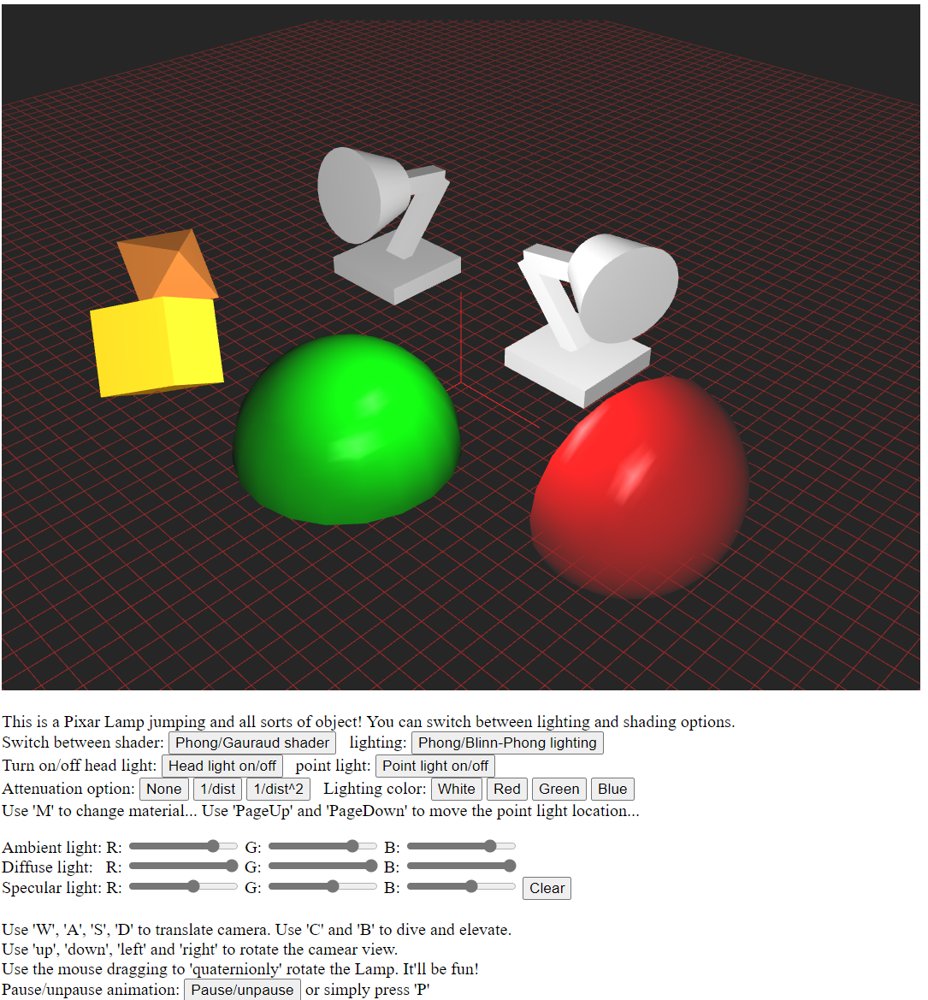
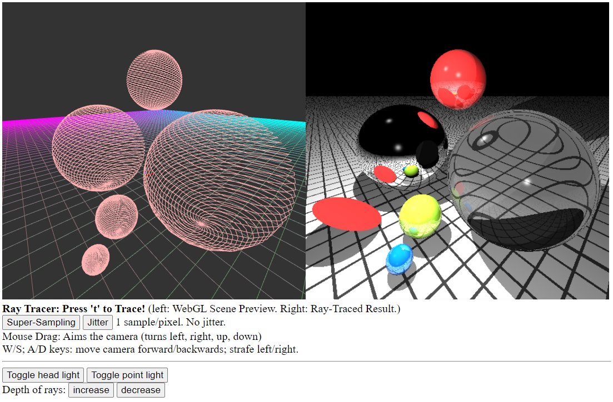

# mechanical devices

### A simple hinge joint and a ball joint. 

Poked by hands

### Hinge-prismatic joint. 

Poked by hands

### Universal joint

Poked by hands

### A cooler universal joint with only prismatic constraints

Driven by the silver part

### Star engine

Driven by the silver part

### Rope bridge

### Rope swing

### Physics cart

# Physics vehicle

### Slope test

https://github.com/legenary/physicsDemo/assets/38062004/e695967c-005c-4f87-8a01-b9ead1731235

### Accelaration, deaccelaration, and jumping

https://github.com/legenary/physicsDemo/assets/38062004/9d083237-7b07-48de-ae34-5370ced77e1c

### Bump test: at low speed

https://github.com/legenary/physicsDemo/assets/38062004/ab65afc2-92d3-425f-a1a4-250c46a4beff

### Bump test: at high speed

https://github.com/legenary/physicsDemo/assets/38062004/e59bbf83-c419-4eca-b6f3-72b3d108f183

### Bump test: at low speed but with extra torque

https://github.com/legenary/physicsDemo/assets/38062004/034417e4-9bf6-4f77-ae6f-40aaf0e23fd4

### Steering test:

https://github.com/legenary/physicsDemo/assets/38062004/506e7d2a-7b70-4640-b720-39b9057b4ae4

Note: steering is a little bit goofy at this stage, for a couple of reasons:

1. For simplicity, the tyre current just uses sphere simplified collision, which leads to only one contact point between each tyre and ground. This is not sufficient to provide enough tractive force and will cause relatively higher slip ratio.

2. The friction force is homogeneous, meaning that the tyre won't provide any more lateral force, as opposed to the tractive force. This makes the vehicle easy to drift.

3. The vehicle doesn't simulate the effect of wind at high speed which provides extra grip.

The tyre model needs to be improved in the future.

# rayTracing

These are two of the course projects for Computer Graphics I&II, where basic idea of illumination/lighting and a simple ray tracing program (and some 3D maths) were implemented.

In the 1st project, the suer was able to switch between Phong and Gauraud shader, as well as between Phong and Blinn-Phong lighting. The user has the choice to turn on and off the head light and point light in space. The user can also adjust the color channel of ambient, diffuse, and specular light, respectively. 

In the 2rd project, a simple ray tracing program was implement. Diffrent materials were used in this demo, including a perfect mirror surface and a see-thru glass material. The user has the choice to super-sample or add jitter in the post-processing part. The depths of rays are also adjustable, although the more depths to trace, the slower the program will become!

In both projects, the user can adjust the location of the camera by W/A/S/D and the camera direction by mouse drag.

# Instructions
Download. In each project folder, click to open "code/RUN.html" to run the little project on a webpage.

